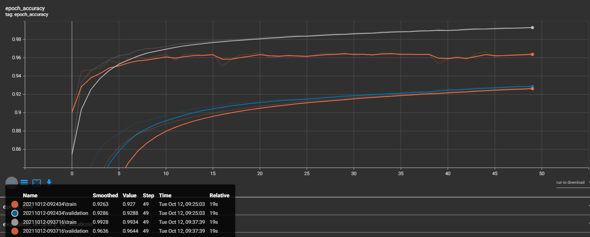

# Här är mina resultat hittils:

# Fråga 7:

## a)
Enligt våra experiment så ser vi ingen tidskillnad vid höjd inlärningshastighet (från 0.01 höjt till 0.1). Under Relative.

Vid testning av att öka inlärningshastighet ännu mer (från 0.01 höjt till 0.5) så ser vi att accuracy på train och validation börjar gå ifrån varandra.
Specifickt att validation accuracy är mindre än train accuracy, se figur a.2

## b)
Enligt våra experiment så ser vi att vid minskande av batch_size (från 256 till 128 och 64) leder till högre prestanda och längre träningstider.

## c)
Enligt våra experiment så ser vi att convolutional_model tar betydligt längre tid att träna jämfört med non_convolutional_model.
Detta pågrund av att: convolutional modellen bygger upp flera 2D egenskapskartor.

## d)
Non-convolutional model: 
- Moved data = 12.33%
- Rotated data = 74.65% 
- Test data = 93.01% 
- Train data = 92.8%

Convolutional model:
- Moved data = 18.47%
- Rotated data = 86.3% 
- Test data = 97.56% 
- Train data = 97.34%

Båda modellerna har mindre accuracy på Moved data, detta beror då på att i moved data har siffrorna flyttats åt ett slumpvis håll och inte längre är centrerade, medan i rotated är alla siffror centrerade dock roterade, vilket förklarar mindre accuracy än Train men mycket högre än Moved. Test och Train är liknande dataset därför mycket liknande accuracy.

## e)
I våra test så ser vi att när vi ökar antalet neuroner så får vi bättre resultat, men också längre träningstider. Vi upplever också att vi nuddar ett tak vid runt 500 neuroner där vid får en accuracy på runt 0.945 och ett undre tak vid 50 där vi får en accuracy på runt 0.935.