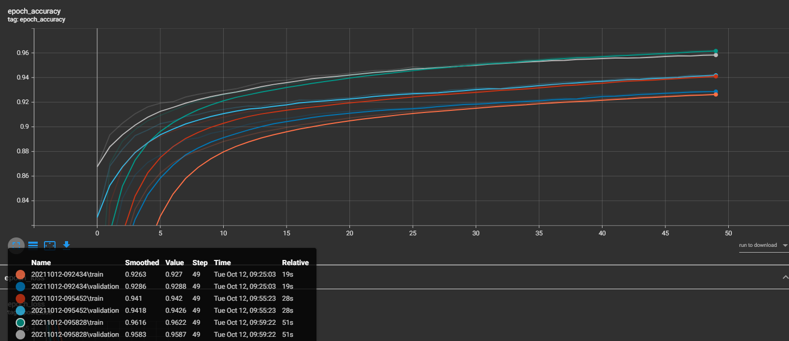

# Här är mina resultat hittils:

# Fråga 7:

## a)
Enligt våra experiment så ser vi ingen tidskillnad vid höjd inlärningshastighet (från 0.01 höjt till 0.1). Under Relative.

Vid testning av att öka inlärningshastighet ännu mer (från 0.01 höjt till till 1 och 2) så ser vi att accuracyn utöver tid är väldigt ostabil och i fallet för inlärningshastighet två (andra bilden) så ser vi att accuracyn ligger runt 0.1.

## b)
Enligt våra experiment så ser vi att vid minskande av batch_size (från 256 till 128 och 64) leder till högre prestanda och längre träningstider.

## c)
Enligt våra experiment så ser vi att convolutional_model tar betydligt längre tid att träna jämfört med non_convolutional_model.
Detta pågrund av att: convolutional modellen bygger upp flera 2D egenskapskartor (matriser) istället för att titta varje pixel för sig. Den tittar alltså t.ex. 4x4 rutor istället.

## d)
Non-convolutional model: 
- Moved data = 12.33%
- Rotated data = 74.65% 
- Test data = 93.01% 
- Train data = 92.8%

Convolutional model:
- Moved data = 18.47%
- Rotated data = 86.3% 
- Test data = 97.56% 
- Train data = 97.34%

Båda modellerna har mindre accuracy på Moved data, detta beror då på att i moved data har siffrorna flyttats åt ett slumpvis håll och inte längre är centrerade, medan i rotated är alla siffror centrerade dock roterade, vilket förklarar mindre accuracy än Train men mycket högre än Moved. Test och Train är liknande dataset därför mycket liknande accuracy.

## e)
I våra test så ser vi att när vi ökar antalet neuroner så får vi bättre resultat, men också längre träningstider. Vi upplever också att vi nuddar ett tak vid runt 500 neuroner där vid får en accuracy på runt 0.945 och ett undre tak vid 50 där vi får en accuracy på runt 0.935.

## f)
### KERNEL_SIZE
I test för Kernel size fick vi följande värden:
- kernel size 2,2 stride 10,10 = 0.23
- kernel size 5,5 stride 10,10 = 0.53
- kernel size 8,8 stride 10,10 = 0.8
- kernel size 10,10 stride 10,10 = 0.87
- kernel size 11,11 stride 10,10 = 0.88
- kernel size 12,12 stride 10,10 = 0.90
- kernel size 16,16 stride 10,10 = 0.92

Utefter det här anser vi att bästa värdet och "taket" ligger vid runt 12,12 i kernel size. Då det inte ökar markant efter detta.

### STRIDE
I test för Stride fick vi följande värden:
Strides:
- 10,10 = 0.7929
- 5,5 = 0.9191
- 4,4 = 0.9447
- 3,3 = 0.9475
- 1,1 = 0.9716

Utefter det här anser vi att bästa värdet är (4,4) då högre stride ger mindre träningstider. Det negativa är att högre stride ger lägre accuraacy, efter 4,4 blir accuracyn för låg för våran smak.

## g)
Här har vi testat flera lager på non-convolutional-model:
- 2 (32,64) lager = 24s och 0.946
- 3 (32,64,128) lager = 28s och 0.964
- 4 (32,54,128,256) lager = 46s och 97.52
- 5 (32,54,128,256,512) lager = 1m 16s och 98.4

Utefter det här så anser vi att tid ökar ju mer lager man lägger till, men också att precisionen ökar.

# Fråga 8:

### Test 1
- Inlärningshastighet 0.01
- Batch_size 64
- Kernel size (12,12)
- Stride (4,4)
- 3 lager (32,64,128)

Resultat: Tid: 1m 53s Precision: 0.9834

Vi anser att tiden blir för hög, men bra precision så vi ökade batch_size
### Test 2
- Inlärningshastighet 0.01
- Batch_size 128
- Kernel size (12,12)
- Stride (4,4)
- 3 lager (32,64,128)

Resultat: Tid: 1m 27s Precision: 0.9754

Vi anser fortfarande att tiden blev hög, och egentligen bara precisionen som försämrades. Sänker då tillbaka batch size och går till 1 lager.
### Test 3
- Inlärningshastighet 0.01
- Batch_size 64
- Kernel size (12,12)
- Stride (4,4)
- 1 lager (32)

Resultat: Tid: 1m 24s Precision: 0.9655

Ungefär samma resultat, bara mindre precision igen. Tillbaka till tre lager och ökar stride till (5,5).
### Test 5
- Inlärningshastighet 0.01
- Batch_size 64
- Kernel size (12,12)
- Stride (5,5)
- 3 lager (32,64,128)

Resultat: Tid: 1m 19s Precision: 0.9749

## Slutsats
Vår slutsats är följande konfiguration på convolutional_model
- Inlärningshastighet 0.01
- Batch_size 64
- Kernel size (12,12)
- Stride (5,5)
- 3 lager (32,64,128)

Med ett Resultat: Tid: 1m 19s Precision: 0.9749
